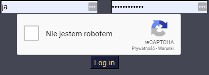

# FeedPi

Small project to set up camera surveillance service on a RaspberryPi (or desktop) with discord notifications. 
Stream is available on web interface and motion detection uses camera footage to determine movement amount between 
frames. It's also possible to get current snapshot on the discord.


Login screen:



Discord notifications:


## Important
If you are considering using ANY wireless device as a security monitoring device, especially WiFi, 
read on how it's easy to jam a WiFi connection and switch to good old wires.
Seriously, it is very easy.

GSM is harder to jam, it's more expensive as it requires special hardware. 
Make sure you implement a heartbeat to monitor condition of your system, or it's monitored by your security service.

Having a server that is hidden somewhere in your house  that will store feed is a nice idea.
It won't help you with targeted break-in but it may help identify persons responsible.

### Used modules
- [P(i|y)Camera](https://github.com/dabku/PiyCamera)- my wrapper for [OpenCV](https://opencv.org/) and [PiCamera](https://picamera.readthedocs.io/en/release-1.13/), allows to use the same code on Windows and rPi
- [ZmqConnector](https://github.com/dabku/ZmqConnector)- my wrapper for [ZeroMQ](http://zeromq.org/), it provides client-server communication betwen discord bot and main process
- [Discord.py](https://github.com/Rapptz/discord.py)- used to create discord bot
- [Flask](http://flask.pocoo.org/)- web interface
### Note

If you ever need monitoring solution, consider following two:
- For motion detection try using PIR sensors.
- For surveillance system solution, dig into [motioneyeos](https://github.com/ccrisan/motioneyeos/wiki).

### Ideas
- send file to gdrive
- log movements and events
- save videos
- email notification
- making it more secure

### Discord bot
Discord bot hosts ZMQ based server 

#### Discord Commands
- !clear N- Clears N messages. If not specified, will clear last one (plus request to clear). 
If clearing messages older than 14 days it will automatically switch to single mode and clear them one by one instead of a batch delete(Discord API limitation)
- !spi_snap- Request latest snap from feed

### Bot communication protocol
As communication is very simple, REST API was not implemented, usual GET/POST messages were also not used.
Instead, communication is using few dictionary templates.

#### Server (discord bot) responses:
Request latest feed snap
```json
{
"type": "request_snap",
"content": {
  "channel_id": discord_channel_id,
  },
}
```
#### Client requests
Send image to discord
```json
{
"type": "send_image",
"content": {
  "channel": 123456789123456789,
  "image_data": image_bytes,
  "message": "Image caption",
  "file_name": "image.png",
  },
}
```
Send message to discord
```json
{
"type": "send_message",
"content": {
  "channel": 123456789123456789,
  "message": "test message",
  },
}
```
Ask discord bot if there is any need to send a snap
```json
{
"type": "request",
"content": None,
}
```
 